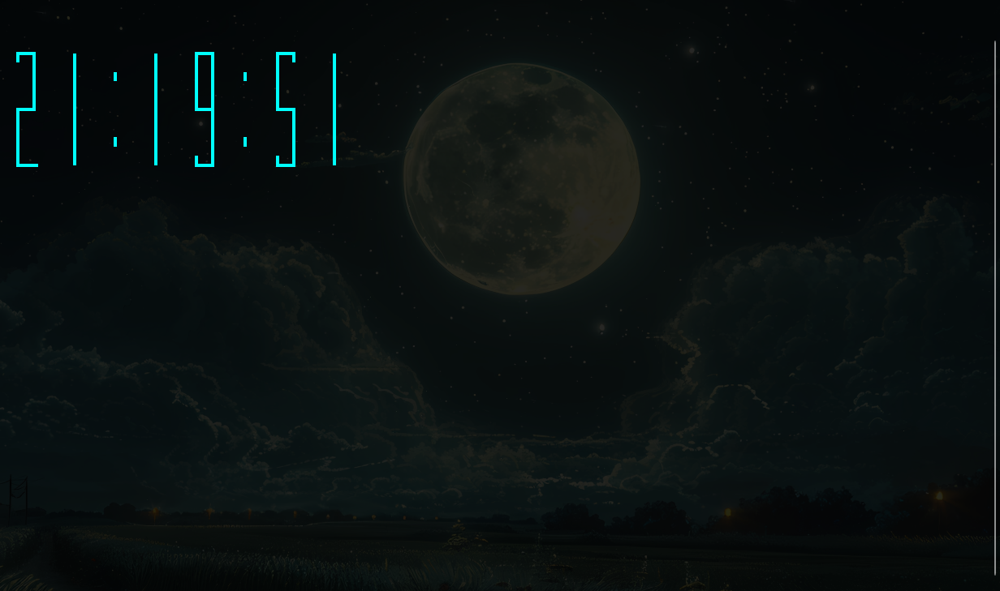

# 🕒 ASCII Clock – Relógio Digital no Terminal (Lua 5.4)

Um relógio digital em **ASCII art**, renderizado diretamente no terminal, inspirado em displays seven-segment.
Feito em **Lua 5.4**, com loop estável utilizando **luaposix** para temporização precisa e tratamento elegante de `CTRL+C`.

<br>

<p align="center">
  
</p>

<br>

---

## ✨ Funcionalidades

* ⏱️ Exibição grande em ASCII (horas, minutos e segundos)
* 🎨 Usa caracteres Unicode — sem flickering e com visual limpo
* 💤 Atualização precisa via `posix.nanosleep`
* 🧹 Redesenho sem artefatos usando ANSI escape codes
* 🛑 Finalização limpa ao pressionar **CTRL+C**
* 🖥️ 100% compatível com Linux, WSL e macOS

---

## 📦 Dependências

* **Lua 5.4**
* **luarocks**
* **luaposix**

---

## 🚀 Instalação

### 1. Instalar Lua 5.4 + luarocks (Ubuntu/WSL)

```bash
sudo apt update
sudo apt install lua5.4 liblua5.4-dev luarocks
```

### 2. Instalar dependências via luarocks (local, sem sudo)

```bash
luarocks install --local luaposix
```

Adicionar luarocks local ao PATH:

```bash
export PATH="$HOME/.luarocks/bin:$PATH"
```

(Deixe isso permanente adicionando ao `~/.bashrc`)

---

## 📁 Estrutura do Projeto

```
lua-clock/
├── assets/
│   └── screenshot.png
├── rockspec.lua
└── src/
    └── main.lua
```

---

## ▶️ Como rodar

```bash
lua src/main.lua
```

ou, caso seu binário seja `lua5.4`:

```bash
lua5.4 src/main.lua
```

---

## 🧠 Como funciona

* **Unicode box-drawing** para montagem dos números
* **ANSI escape sequences** para limpar/redesenhar a tela
* **Precisão de tempo** com `posix.nanosleep`
* **Tratamento de sinais** para saída limpa com CTRL+C

## 📜 Licença

Distribuído sob a licença **MIT**.
Veja o arquivo [`LICENSE`](LICENSE) para mais detalhes.
